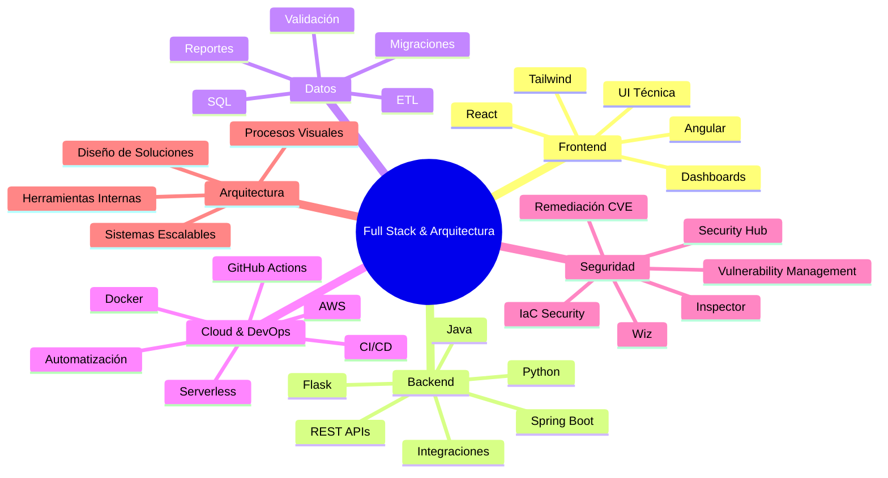
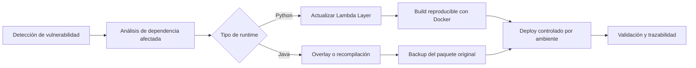

# 👋 Hola, soy Yordi

### Full Stack Developer · Arquitecto de Soluciones · Backend · Datos · Cloud · Seguridad

Construyo soluciones full stack, sistemas backend, APIs, herramientas ETL, dashboards, automatizaciones y arquitecturas cloud seguras. Me gusta convertir procesos complejos en software útil, escalable y mantenible, conectando arquitectura, datos, frontend, backend, seguridad y automatización.

---

## 🚀 Perfil profesional

```txt
Full Stack Developer | Backend & Solution Architect | Cloud Security | APIs | ETL | Data | Automation
```

- Desarrollo aplicaciones full stack con enfoque en arquitectura limpia.
- Diseño APIs, servicios backend, integraciones y procesos de datos.
- Construyo herramientas internas, dashboards y automatizaciones.
- Trabajo con bases de datos, validación de información y migraciones.
- Diseño soluciones cloud con foco en seguridad, trazabilidad y operación.
- Automatizo procesos de remediación de vulnerabilidades en ambientes serverless.
- Me enfoco en soluciones prácticas, escalables, mantenibles y seguras.

---

## 🧠 Áreas principales



---

## 🛠️ Tecnologías

### Lenguajes y Backend


### Frontend


### Datos, Cloud, Seguridad y DevOps


---

## 🔐 Seguridad Cloud y Remediación de Vulnerabilidades

He trabajado en la remediación de vulnerabilidades sobre arquitecturas serverless en AWS, aplicando procesos controlados para ambientes separados de desarrollo, validación y producción, sin exponer información sensible de cuentas, clientes o proyectos.

### Experiencia destacada

- Remediación de vulnerabilidades en arquitecturas **serverless** con múltiples funciones AWS Lambda.
- Gestión de dependencias en **Python Lambda Layers** y paquetes Java empaquetados como **fat JAR / uber JAR**.
- Actualización centralizada de layers para corregir vulnerabilidades en varias funciones con bajo impacto operativo.
- Aplicación de overlays controlados en paquetes Java para reemplazar librerías vulnerables sin recompilar todo el proyecto.
- Automatización de builds y despliegues usando **Docker**, **AWS CLI**, **CloudFormation**, **SAM** y scripts PowerShell.
- Validación previa de identidad y ambiente antes de ejecutar cambios en infraestructura cloud.
- Generación de respaldos antes de modificar paquetes desplegados.
- Documentación de evidencias para auditoría: CVE, versión vulnerable, versión corregida, alcance, resultado y trazabilidad.

### Herramientas y prácticas

```txt
AWS Lambda · CloudFormation · AWS SAM · Docker · Python Layers · Java 21 · PowerShell · AWS CLI · Wiz · AWS Inspector · Security Hub
```

### Enfoque de remediación



### Resultados técnicos

- Gestión de remediaciones sobre decenas de funciones serverless.
- Corrección de vulnerabilidades críticas, altas y medias en dependencias de backend.
- Reducción del tiempo de remediación mediante automatización y layers reutilizables.
- Separación segura de ambientes y ejecución controlada por perfiles/permisos.
- Estrategia de rollback mediante versionado de layers y backups de paquetes.

---

## 📊 GitHub Stats


---

## 📈 Actividad


---

## 🧩 Cómo pienso el software

> Construyo soluciones prácticas, limpias, escalables y seguras para resolver problemas reales con tecnología.

Para mí, buen software no es solo código: es arquitectura, datos, experiencia de usuario, seguridad, automatización, despliegue y contexto de negocio trabajando juntos.

---

## 🎯 Enfoque actual

- Arquitectura full stack
- APIs y microservicios
- Automatización de procesos
- Plataformas ETL
- Dashboards y analítica
- Cloud con AWS
- Seguridad cloud y remediación de vulnerabilidades
- Infraestructura como código
- Herramientas internas
- DevOps y CI/CD
