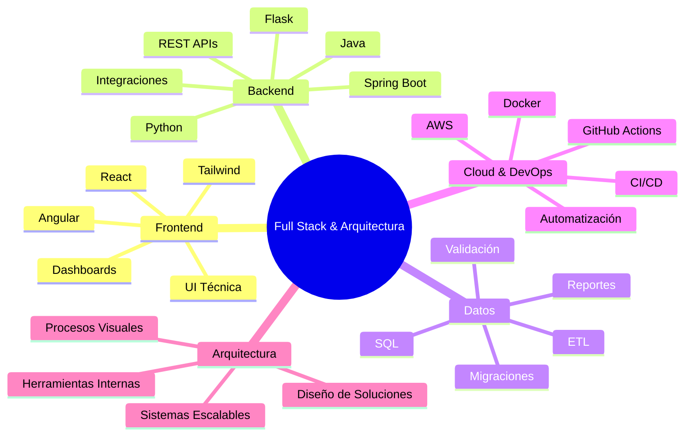

# 👋 Hola, soy Yordi

### Full Stack Developer · Arquitecto de Soluciones · Backend · Datos · Cloud

Construyo soluciones full stack, sistemas backend, APIs, herramientas ETL, dashboards y automatizaciones listas para la nube. Me gusta convertir procesos complejos en software útil, escalable y mantenible, conectando arquitectura, datos, frontend, backend y automatización.

---

## 🚀 Perfil profesional

```txt
Full Stack Developer | Backend & Solution Architect | APIs | ETL | Cloud | Data | Automation
```

- Desarrollo aplicaciones full stack con enfoque en arquitectura limpia.
- Diseño APIs, servicios backend, integraciones y procesos de datos.
- Construyo herramientas internas, dashboards y automatizaciones.
- Trabajo con bases de datos, validación de información y migraciones.
- Me enfoco en soluciones prácticas, escalables y mantenibles.

---

## 🧠 Áreas principales



---

## 🛠️ Tecnologías

### Lenguajes y Backend


### Frontend


### Datos, Cloud y DevOps


---

## 📊 GitHub Stats


---

## 📈 Actividad


---

## 🧩 Cómo pienso el software

> Construyo soluciones prácticas, limpias y escalables para resolver problemas reales con tecnología.

Para mí, buen software no es solo código: es arquitectura, datos, experiencia de usuario, automatización, despliegue y contexto de negocio trabajando juntos.

---

## 🎯 Enfoque actual

- Arquitectura full stack
- APIs y microservicios
- Automatización de procesos
- Plataformas ETL
- Dashboards y analítica
- Cloud con AWS
- Herramientas internas
- DevOps y CI/CD
